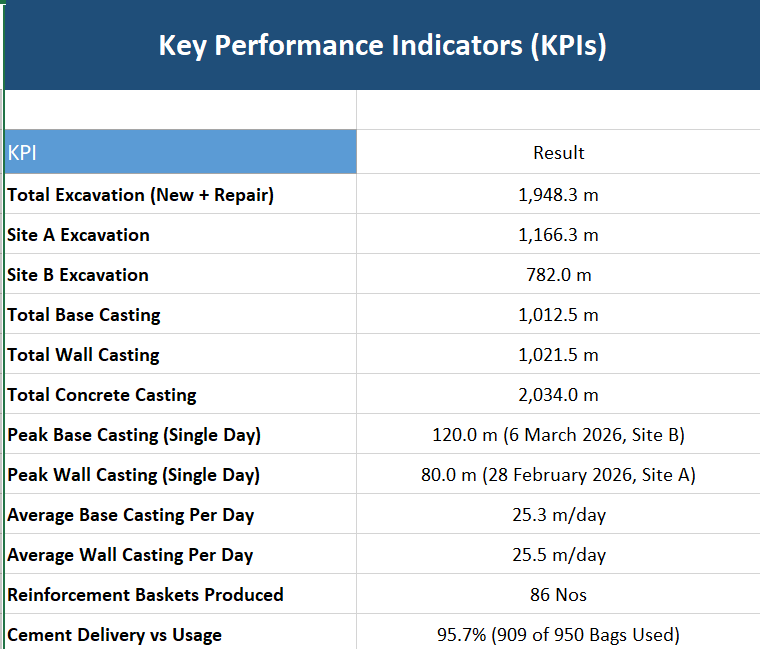
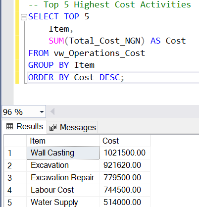
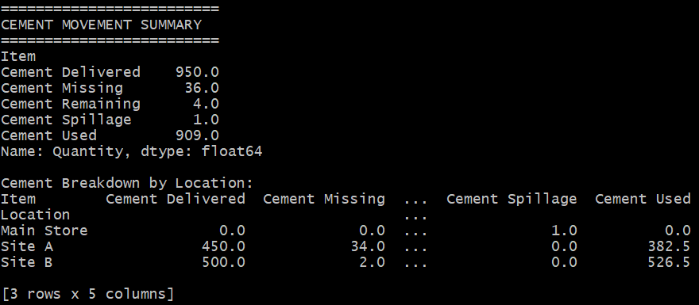
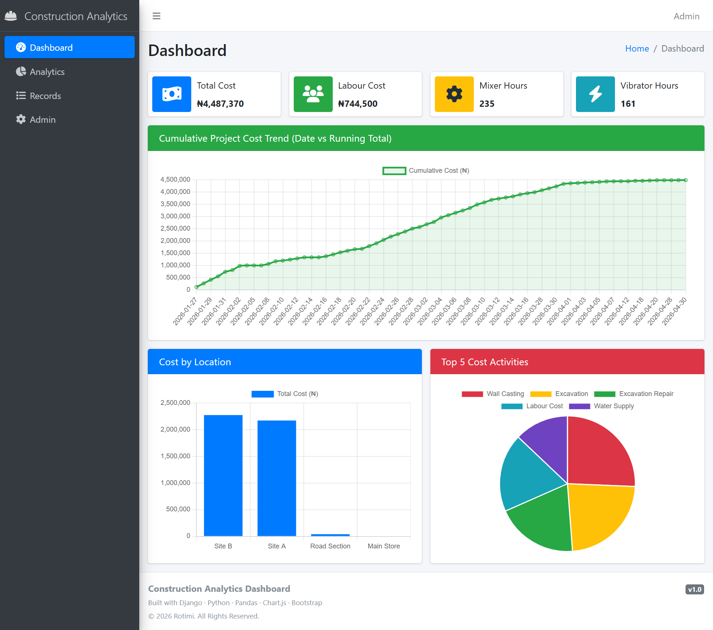

# Construction Operations Analytics


 


## Project Focus

Although this project is based on operational data from a real road drainage construction project, its primary focus is data analytics — not construction itself.

My goal was to demonstrate how raw, unstructured operational records can be transformed into clean datasets, automated reports, interactive dashboards, and a deployed web application. Construction serves as the real-world context for this project, while the primary focus is demonstrating an end-to-end data analytics workflow.

The same analytics workflow can be applied across industries — including **healthcare, manufacturing, logistics, agriculture, energy, and finance**.

---

## 🌐 Live Demo

The Django dashboard is deployed and live — you can explore it here:

👉 **[View Live Dashboard](https://rotimi5050.pythonanywhere.com)**


---

## Project Overview

Construction sites generate large volumes of operational data every day — from material deliveries and labour activities to equipment usage, costs, and progress updates. The problem is that most of it lives in messy, unstructured formats (chat logs, notes, scattered spreadsheets), which makes it hard to actually learn anything from it.

This project shows how that raw, everyday site data can be turned into something structured and useful — supporting:

- Material tracking
- Cost monitoring
- Productivity analysis
- KPI reporting
- Operational decision-making
- Executive reporting

The project follows the complete analytics lifecycle — from raw operational records to business-ready dashboards and automated reporting.

---

## Data Source

The raw data was extracted from WhatsApp group and private chat conversations used to manage a real road drainage construction project between **January and May 2026**.

The original conversations included:

- Daily site updates
- Material deliveries and usage
- Labour and equipment records
- Expense reports
- Project progress updates
- General team coordination messages

Before any of this was published, all personal names, phone numbers, and other identifying details were removed or anonymised. Only the operational information required for analysis has been retained.

---

## Project Workflow

```text
WhatsApp Export (TXT)
        │
        ▼
Data Cleaning & Anonymisation
        │
        ▼
Excel Data Preparation
        │
        ▼
Structured Master Dataset
        │
        ├────────► SQL Server Analysis
        │
        ├────────► Python Automation
        │
        ├────────► Power BI Dashboard
        │
        └────────► Django Web Application
                        │
                        ▼
                PythonAnywhere Deployment
                        │
                        ▼
                  GitHub Portfolio
```

Each stage of the workflow is documented within its respective project folder, making it easy to follow how the data moves from raw records to business-ready insights.

---

## Repository Structure

```text
construction-data-analytics/
│
├── data/                         # Project datasets
│   ├── raw/                      # Anonymised raw records
│   ├── cleaned/                  # Cleaned operational records
│   ├── Operations_Master_Log.csv
│   └── README.md
│
├── excel/                        # Excel workbook and PDF exports
│   ├── Operations_Analytics_Portfolio.xlsx
│   ├── pdf/
│   └── README.md
│
├── sql/                          # SQL scripts
│   ├── create_tables.sql
│   ├── import_data.sql
│   ├── data_validation.sql
│   ├── data_cleaning.sql
│   ├── analysis_queries.sql
│   ├── screenshots/
│   └── README.md
│
├── python/                       # Python analysis and automation
│   ├── construction_analytics.ipynb
│   ├── construction_analytics.py
│   ├── requirements.txt
│   ├── outputs/
│   │   ├── charts/
│   │   ├── csv/
│   │   └── reports/
│   └── README.md
│
├── power_bi/                     # Power BI dashboard
│   ├── Operations_Performance_Dashboard.pbix
│   ├── dashboard.pdf
│   ├── dax/
│   ├── screenshots/
│   └── README.md
│
├── screenshots/                     # Django dashboard (live preview)
│   ├── django/
 │   └── README.md
|
├── LICENSE
└── README.md                     # Main project documentation
```

---

## Technologies Used

| Category | Tools |
|---|---|
| **Data Collection & Preparation** | Microsoft Excel, CSV, Data Cleaning, Data Validation, Data Standardisation |
| **Data Analysis** | SQL Server, Python, Pandas, Matplotlib, OpenPyXL |
| **Business Intelligence** | Power BI, DAX, KPI Dashboards, Pivot Tables & Charts |
| **Web Development** | Django, HTML, CSS, Bootstrap, Chart.js, AdminLTE |
| **Version Control** | Git, GitHub |

---

## Key Features

- Cleaned and anonymised real construction site operational data
- Structured master dataset built for analysis
- Construction activity tracking
- Material inventory management
- Cement reconciliation
- Cost analysis
- Labour and equipment reporting
- KPI dashboard
- Interactive Power BI reports
- Automated Python reporting
- SQL data validation and business queries
- Executive summaries and PDF reports

---

## Repository Guide

| Folder | Purpose |
|---|---|
| **`data/`** | Raw, anonymised, and cleaned datasets used throughout the project |
| **`excel/`** | Excel workbook with dashboards, summaries, KPI reports, and PDF exports |
| **`sql/`** | SQL scripts for database creation, validation, cleaning, and business analysis |
| **`python/`** | Python automation, data processing, charts, CSV exports, and Excel reports |
| **`power_bi/`** | Interactive Power BI dashboard, DAX documentation, and screenshots |
| **`screenshots/`** | Screenshots of the deployed Django web application (live dashboard) |

Each folder has its own README with more detail on what's inside.

---

## Skills Demonstrated

**Data Analytics** — Data Cleaning, Data Validation, Data Transformation, Exploratory Data Analysis, KPI Development, Business Reporting

**Excel** — Pivot Tables, Pivot Charts, Dashboards, Conditional Formatting, Lookup Functions, Data Validation

**SQL** — Database Design, Data Import, Data Cleaning, Aggregate Functions, CASE WHEN, Common Business Queries

**Python** — Pandas, Data Processing, Automation, Matplotlib, Excel Report Generation

**Power BI** — Interactive Dashboards, Data Modelling, DAX Measures, Calculated Columns, Visual Analytics

**Django** — Dashboard Development, Data Presentation, Reporting Interface, Deployment (PythonAnywhere)

---

## A Look at Each Stage

### Excel Analytics
A comprehensive Excel workbook featuring KPI summaries, project cost analysis, material tracking, cement reconciliation, pivot analysis, and executive-ready PDF reports.



---

### SQL Analysis

A relational database designed from scratch, with imported and validated operational data, cleaned inconsistencies, and business-focused analytical queries.

**Sample Query — Top 5 Highest Cost Activities**

```sql
SELECT TOP 5
    Item,
    SUM(Total_Cost_NGN) AS Cost
FROM vw_Operations_Cost
GROUP BY Item
ORDER BY Cost DESC;
```

**Sample Output**



---

### Python Automation

Automated data cleaning and validation, chart generation, KPI summaries, CSV exports, and Excel report generation—covering costs, productivity, equipment, and material usage.

**Sample Code — Cement Reconciliation (Pandas)**

```python
# ------------------------------------------------------------
# 10.0 CEMENT RECONCILIATION
# ------------------------------------------------------------
print("\n" + "=" * 25)
print("CEMENT MOVEMENT SUMMARY")
print("=" * 25)

cement = df[df["Item"].str.contains("Cement", na=False)]
cement_summary = cement.groupby("Item")["Quantity"].sum()
print(cement_summary)

cement_pivot = (
    df[df["Item"].str.contains("Cement", na=False)]
    .pivot_table(
        index="Location",
        columns="Item",
        values="Quantity",
        aggfunc="sum",
        fill_value=0
    )
)

print("\nCement Breakdown by Location:")
print(cement_pivot)
```

**Sample Output**



---

### Power BI Dashboard

An interactive Power BI dashboard built to monitor project costs, construction activities, material consumption, equipment utilisation, and overall project performance. The report includes custom DAX measures, calculated columns, and interactive visualisations to support operational decision-making.

#### Dashboard Previews


**Sample DAX Measure — Total Project Cost**

```dax
Total Project Cost =
    SUM ( Site_Log[Labour_Cost_NGN] )
    + SUM ( Site_Log[Excavation_Cost_NGN] )
    + SUM ( Site_Log[Base_Casting_Cost_NGN] )
    + SUM ( Site_Log[Wall_Casting_Cost_NGN] )
    + SUM ( Site_Log[Water_Trip_Cost_NGN] )
```

The complete list of DAX measures and calculated columns is available in the `power_bi/dax/` folder.

---

### Django Web Application
An interactive analytics dashboard with searchable operational records, live charts, and reports, wrapped in a responsive interface and deployed on PythonAnywhere.




---

## Key Insights

The analysis covers:

- Construction activities
- Material deliveries and consumption
- Cement reconciliation
- Labour costs
- Equipment utilisation
- Transportation costs
- Operational expenses
- Project productivity
- Cost trends
- Site performance

---

## Data Privacy

The original records contained real project communication data. Before anything was published:

- Personal names were removed.
- Phone numbers were removed.
- Sensitive project information was anonymised.
- Only what was needed for analysis was kept.

The published dataset contains only anonymised operational information required for analytical purposes.

---

## Who This Project Is For

The skills demonstrated here translate well across:

- Construction
- Engineering
- Project Management
- Operations
- Supply Chain
- Manufacturing
- Infrastructure

The goal was to show a genuinely complete analytics workflow — from messy raw data to a live, usable dashboard — not just an isolated exercise.

---

## Running the Project

**Clone the repository**
```bash
git clone https://github.com/rotimi2020/construction-data-analytics.git
cd construction-data-analytics
```

**Install Python dependencies**
```bash
cd python
pip install -r requirements.txt
```

**Run the analysis**
```bash
python construction_analytics.py
```

Or, if you'd rather explore it interactively:
```bash
jupyter notebook construction_analytics.ipynb
```

**Explore the other pieces**
- **Excel:** `excel/Operations_Analytics_Portfolio.xlsx`
- **SQL:** run the scripts in the `sql/` folder
- **Power BI:** open `power_bi/Operations_Performance_Dashboard.pbix`
- **Django:** visit the live dashboard linked above

---

## Future Improvements

A few directions I'd like to take this further:

- Machine learning for project cost prediction
- Forecasting material consumption
- Automated data ingestion
- Real-time dashboard updates
- GIS and location-based visualisation

---

## Author

**Rotimi S. Omosewo**

- LinkedIn: [linkedin.com/in/rotimi-sheriff-omosewo](https://linkedin.com/in/rotimi-sheriff-omosewo)
- GitHub: [github.com/rotimi2020](https://github.com/rotimi2020/)
- Portfolio: [rotimi2020.github.io](https://rotimi2020.github.io/)
- Live Dashboard: [rotimi5050.pythonanywhere.com](https://rotimi5050.pythonanywhere.com)

---

## License

This project is released under the MIT License.