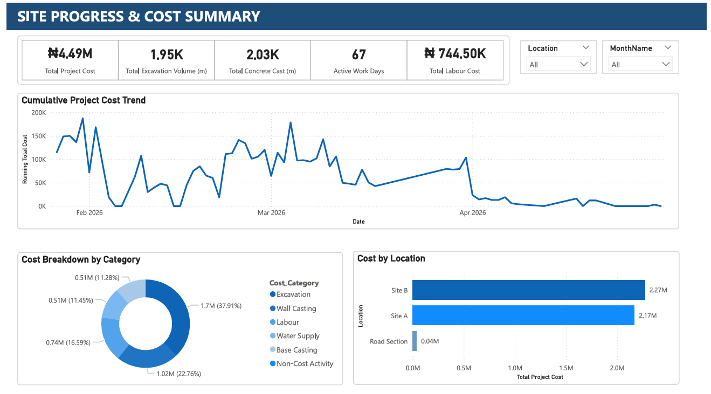
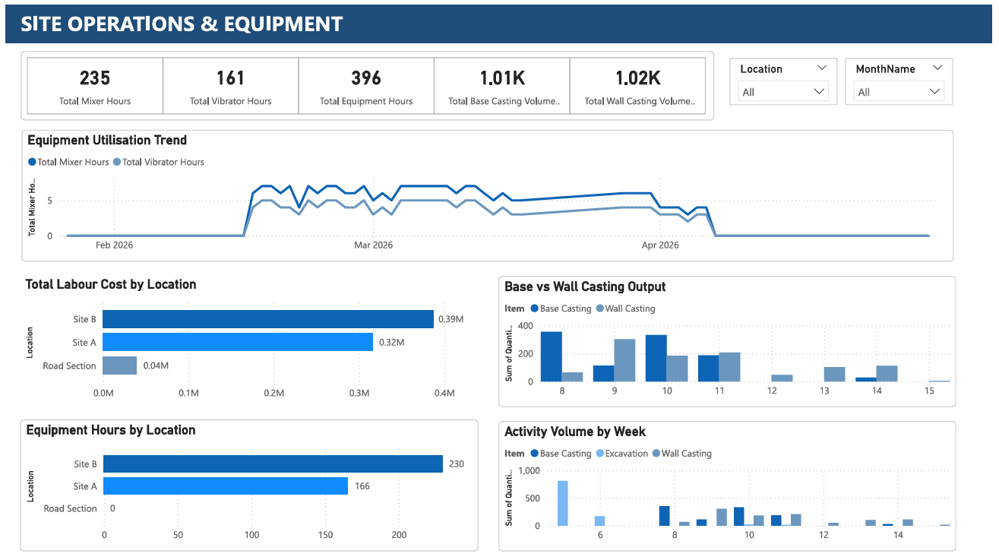
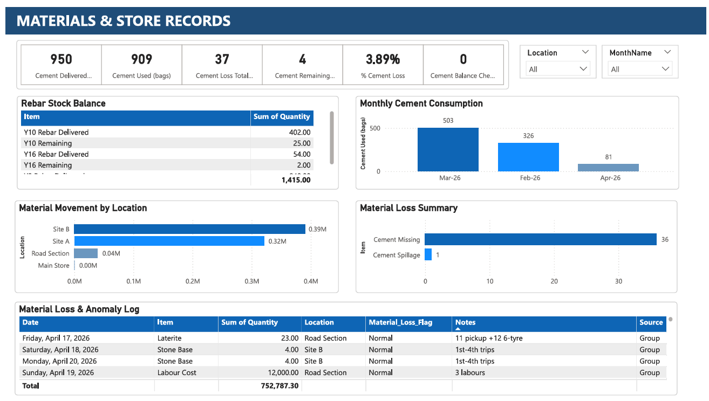

# Construction Operations Analytics


## 🌐 Live Demo

The Django dashboard is deployed and live — you can explore it here:

👉 **[View Live Dashboard](https://rotimi5050.pythonanywhere.com)**

---

## 📚 Table of Contents

- [📋 Executive Summary](#-executive-summary)
- [🏗️ Business Problem](#️-business-problem)
- [🧩 Problem Statement](#-problem-statement)
- [🎯 Project Objectives](#-project-objectives)
- [❓ Business Questions Answered](#-business-questions-answered)
- [📂 Dataset Overview & Data Source](#-dataset-overview--data-source)
- [📖 Data Dictionary](#-data-dictionary)
- [🔄 Methodology / Workflow](#-methodology--workflow)
- [🗂️ Repository Structure](#️-repository-structure)
- [🛠️ Technology Stack](#️-technology-stack)
- [🧠 Skills Demonstrated](#-skills-demonstrated)
- [📏 Business Rules / Assumptions](#-business-rules--assumptions)
- [🔍 Analysis & Dashboard: A Look at Each Stage](#-analysis--dashboard-a-look-at-each-stage)
  - [Excel Analytics](#excel-analytics)
  - [SQL Analysis](#sql-analysis)
  - [Python Automation](#python-automation)
  - [Power BI Dashboard](#power-bi-dashboard)
  - [Django Web Application](#django-web-application)
- [🔑 Key Insights & Findings](#-key-insights--findings)
- [💡 Recommendations & Business Impact](#-recommendations--business-impact)
- [🧰 Tool Evaluation](#-tool-evaluation)
- [⚠️ Limitations](#️-limitations)
- [🔒 Data Privacy](#-data-privacy)
- [🎯 Who This Project Is For](#-who-this-project-is-for)
- [⚙️ Running the Project](#️-running-the-project)
- [🚀 Future Improvements](#-future-improvements)
- [✅ Conclusion](#-conclusion)
- [🙋‍♂️ Author](#️-author)
- [📄 License](#-license)
- [🙏 Acknowledgements](#-acknowledgements)

---

## 📋 Executive Summary

This project turns raw, unstructured WhatsApp-based site communication from a real road drainage construction project (January–May 2026) into a full analytics pipeline: cleaned datasets, SQL analysis, Python automation, an interactive Power BI dashboard, and a live Django web application. Across the project, ₦4,487,370 in total spend was fully reconciled across excavation, casting, labour, and water costs, and cement usage was tracked to 95.7% utilisation. While the context is construction, the focus is the end-to-end data analytics workflow — from messy raw records to a deployed, business-ready product — a workflow directly transferable to operations and analytics roles in any industry.

---

## 🏗️ Business Problem

Construction sites generate large volumes of operational data every day — material deliveries, labour activity, equipment usage, costs, and progress updates. In most small-to-mid-size projects, this data lives in messy, unstructured formats: chat logs, verbal updates, scattered spreadsheets, or nothing at all. Without a structured system to capture and analyse it, project managers struggle to answer basic questions — where the money is going, whether materials are being used or lost, and whether the project is on track — until it's too late to act on the answer.

---

## 🧩 Problem Statement

This specific project needed to turn day-to-day WhatsApp communication — used informally to manage a real road drainage build — into a structured, analysable record of site operations. The goal was to answer: how much was actually spent and where, whether material usage (particularly cement) matched what was delivered, how productive the site was over time, and where cost or quality exceptions were occurring — all without any dedicated tracking system in place at the time the work happened.

---

## 🎯 Project Objectives

Although this project is based on operational data from a real road drainage construction project, its primary focus is data analytics — not construction itself.

My goal was to demonstrate how raw, unstructured operational records can be transformed into clean datasets, automated reports, interactive dashboards, and a deployed web application. Construction serves as the real-world context for this project, while the primary focus is demonstrating an end-to-end data analytics workflow — supporting:

- Material tracking
- Cost monitoring
- Productivity analysis
- KPI reporting
- Operational decision-making
- Executive reporting

The same analytics workflow can be applied across industries — including **healthcare, manufacturing, logistics, agriculture, energy, and finance**.

---

## ❓ Business Questions Answered

- **What was the total project cost and how was it distributed?**
  Total cost: ₦4,487,370 — breakdown: Excavation (37.9%), Casting (34.1%), Labour (16.6%), Water (11.5%).

- **Which site was more expensive, and why?**
  Site B accounted for 50.7% of total cost (₦2,274,850), while Site A accounted for 48.4% (₦2,172,520). The difference is driven by higher excavation volumes at Site B.

- **How was cement usage tracked and reconciled?**
  Of 950 bags delivered, 909 were used, 36 went missing, 1 was spilled, and 4 remained — a 95.7% utilisation rate.

- **What was the productivity trend over time?**
  Peak casting occurred in March 2026, with 80m of wall casting achieved in a single day (Site A). Productivity was consistent but slowed during the Eid al-Fitr holiday period.

- **What were the key exceptions or anomalies?**
  Excavation rate exceptions were flagged where rates deviated from the expected ₦800–₦1,000 per metre range, highlighting areas for quality review.

---

## 📂 Dataset Overview & Data Source

The raw data was extracted from WhatsApp group and private chat conversations used to manage a real road drainage construction project between **January and May 2026**.

The original conversations included:

- Daily site updates
- Material deliveries and usage
- Labour and equipment records
- Expense reports
- Project progress updates
- General team coordination messages

Before any of this was published, all personal names, phone numbers, and other identifying details were removed or anonymised. Only the operational information required for analysis has been retained. The result is a single structured master dataset (`Operations_Master_Log.csv`) covering activities, materials, costs, and locations across the full project timeline.

---

## 📖 Data Dictionary

Core fields used across the SQL, Python, and Power BI analysis:

| Field | Description |
|---|---|
| `Item` | The material, activity, or cost line being recorded (e.g. Cement, Excavation) |
| `Quantity` | Amount of material delivered, used, or remaining |
| `Location` | Site or section the record relates to (e.g. Site A, Site B, Road Section) |
| `Total_Cost_NGN` | Total recorded cost for a given activity or item, in Naira |
| `Labour_Cost_NGN` | Cost attributed to labour for a given record |
| `Excavation_Cost_NGN` | Cost attributed to excavation work |
| `Base_Casting_Cost_NGN` | Cost attributed to base casting activity |
| `Wall_Casting_Cost_NGN` | Cost attributed to wall casting activity |
| `Water_Trip_Cost_NGN` | Cost attributed to water supply trips |

> The full column-level dictionary (including any additional fields used only in the Excel workbook or Power BI model) lives alongside the dataset in `data/README.md`.

---

## 🔄 Methodology / Workflow

```text
WhatsApp Export (TXT)
        │
        ▼
Data Cleaning & Anonymisation
        │
        ▼
Excel Data Preparation
        │
        ▼
Structured Master Dataset
        │
        ├────────► SQL Server Analysis
        │
        ├────────► Python Automation
        │
        ├────────► Power BI Dashboard
        │
        └────────► Django Web Application
                        │
                        ▼
                PythonAnywhere Deployment
                        │
                        ▼
                  GitHub Portfolio
```

Each stage of the workflow is documented within its respective project folder, making it easy to follow how the data moves from raw records to business-ready insights.

---

## 🗂️ Repository Structure

```text
construction-data-analytics/
│
├── data/                         # Project datasets
│   ├── raw/                      # Anonymised raw records
│   ├── cleaned/                  # Cleaned operational records
│   ├── Operations_Master_Log.csv
│   └── README.md
│
├── excel/                        # Excel workbook and PDF exports
│   ├── Operations_Analytics_Portfolio.xlsx
│   ├── pdf/
│   └── README.md
│
├── sql/                          # SQL scripts
│   ├── create_tables.sql
│   ├── import_data.sql
│   ├── data_validation.sql
│   ├── data_cleaning.sql
│   ├── analysis_queries.sql
│   ├── screenshots/
│   └── README.md
│
├── python/                       # Python analysis and automation
│   ├── construction_analytics.ipynb
│   ├── construction_analytics.py
│   ├── requirements.txt
│   ├── outputs/
│   │   ├── charts/
│   │   ├── csv/
│   │   └── reports/
│   └── README.md
│
├── power_bi/                     # Power BI dashboard
│   ├── Operations_Performance_Dashboard.pbix
│   ├── dashboard.pdf
│   ├── dax/
│   ├── screenshots/
│   └── README.md
│
├── screenshots/                  # Django dashboard (live preview)
│   ├── django/
│   └── README.md
│
├── LICENSE
└── README.md                     # Main project documentation
```

---

## 🛠️ Technology Stack

| Category | Tools |
|---|---|
| **Data Collection & Preparation** | Microsoft Excel, CSV, Data Cleaning, Data Validation, Data Standardisation |
| **Data Analysis** | SQL Server, Python, Pandas, Matplotlib, OpenPyXL |
| **Business Intelligence** | Power BI, DAX, KPI Dashboards, Pivot Tables & Charts |
| **Web Development** | Django, HTML, CSS, Bootstrap, Chart.js, AdminLTE |
| **Version Control** | Git, GitHub |

---

## 🧠 Skills Demonstrated

**Data Analytics** — Data Cleaning, Data Validation, Data Transformation, Exploratory Data Analysis, KPI Development, Business Reporting

**Excel** — Pivot Tables, Pivot Charts, Dashboards, Conditional Formatting, Lookup Functions, Data Validation

**SQL** — Database Design, Data Import, Data Cleaning, Aggregate Functions, CASE WHEN, Common Business Queries

**Python** — Pandas, Data Processing, Automation, Matplotlib, Excel Report Generation

**Power BI** — Interactive Dashboards, Data Modelling, DAX Measures, Calculated Columns, Visual Analytics

**Django** — Dashboard Development, Data Presentation, Reporting Interface, Deployment (PythonAnywhere)

---

## 📏 Business Rules / Assumptions

- Excavation cost is expected to fall within a **₦800–₦1,000 per metre** range; anything outside this band is flagged as an exception for review rather than automatically corrected.
- Cement reconciliation treats delivered bags as the baseline; the difference between delivered and used+missing+spilled+remaining must sum to zero for a record to be considered fully reconciled.
- All personal names, phone numbers, and other identifying details were removed or anonymised before publication — only operational data required for analysis was retained.
- Costs are recorded in Nigerian Naira (₦/NGN) throughout, reflecting the project's local currency.

---

## 🔍 Analysis & Dashboard: A Look at Each Stage

### Excel Analytics

A comprehensive Excel workbook featuring KPI summaries, project cost analysis, material tracking, cement reconciliation, pivot analysis, and executive-ready PDF reports.


---

### SQL Analysis

A relational database designed from scratch, with imported and validated operational data, cleaned inconsistencies, and business-focused analytical queries.

**Sample Query — Top 5 Highest Cost Activities**

```sql
SELECT TOP 5
    Item,
    SUM(Total_Cost_NGN) AS Cost
FROM vw_Operations_Cost
GROUP BY Item
ORDER BY Cost DESC;
```

**Sample Output**


---

### Python Automation

Automated data cleaning and validation, chart generation, KPI summaries, CSV exports, and Excel report generation — covering costs, productivity, equipment, and material usage.

**Sample Code — Cement Reconciliation (Pandas)**

```python
# ------------------------------------------------------------
# 10.0 CEMENT RECONCILIATION
# ------------------------------------------------------------
print("\n" + "=" * 25)
print("CEMENT MOVEMENT SUMMARY")
print("=" * 25)

cement = df[df["Item"].str.contains("Cement", na=False)]
cement_summary = cement.groupby("Item")["Quantity"].sum()
print(cement_summary)

cement_pivot = (
    df[df["Item"].str.contains("Cement", na=False)]
    .pivot_table(
        index="Location",
        columns="Item",
        values="Quantity",
        aggfunc="sum",
        fill_value=0
    )
)

print("\nCement Breakdown by Location:")
print(cement_pivot)
```

**Sample Output**


---

### Power BI Dashboard

An interactive Power BI dashboard built to monitor project costs, construction activities, material consumption, equipment utilisation, and overall project performance. The report includes custom DAX measures, calculated columns, and interactive visualisations to support operational decision-making.

#### Dashboard Previews







**Sample DAX Measure — Total Project Cost**

```dax
Total Project Cost =
    SUM ( Site_Log[Labour_Cost_NGN] )
    + SUM ( Site_Log[Excavation_Cost_NGN] )
    + SUM ( Site_Log[Base_Casting_Cost_NGN] )
    + SUM ( Site_Log[Wall_Casting_Cost_NGN] )
    + SUM ( Site_Log[Water_Trip_Cost_NGN] )
```

The complete list of DAX measures and calculated columns is available in the `power_bi/dax/` folder.

---

### Django Web Application

The final stage of the analytics pipeline – a fully deployed web application built with Django. It presents the cleaned operational data through an interactive dashboard with searchable records, live charts, and exportable reports.

---

## 🔑 Key Insights & Findings

### 📦 Material & Production
- **Total Excavation:** 1,948.3m (Site A: 1,166.3m | Site B: 782.0m)
- **Total Concrete Casting:** 2,034.0m (Base: 1,012.5m | Wall: 1,021.5m)
- **Peak Daily Base Casting:** 120m (6 March 2026, Site B)
- **Peak Daily Wall Casting:** 80m (28 February 2026, Site A)
- **Reinforcement Baskets Produced:** 86 Nos
- **Cement Utilisation:** 95.7% (909 of 950 bags used)
- **Cement Loss Rate:** 3.9% (37 of 950 bags — 36 missing, 1 spillage)

### 💰 Cost & Financials
- **Total Project Cost:** ₦4,487,370
- **Labour Cost:** ₦744,500 (16.6% of total)
- **Excavation Cost:** ₦1,701,120 (37.9% of total)
- **Casting Cost:** ₦1,527,750 (34.1% of total)
- **Water Supply Cost:** ₦514,000 (11.5% of total)
- **Cost Per Metre Excavated:** ₦873/m
- **Average Weekly Expenditure:** ₦320,527
- **Peak Week Expenditure:** ₦809,720 (Week 5)

### 🏗️ Site Performance
- **Site A Cost:** ₦2,172,520 (48.4%)
- **Site B Cost:** ₦2,274,850 (50.7%)
- **Road Section Cost:** ₦40,000 (0.9%)
- **Active Construction Period:** 14 Weeks (Jan – Apr 2026)
- **Mixer Utilisation:** 235 Hours (Avg 5.9 hrs/day)
- **Vibrator Utilisation:** 161 Hours (Avg 4.0 hrs/day)
- **Mixer-to-Vibrator Ratio:** 1.46 : 1

### 📊 Inventory Accuracy
- **Y8 Steel Utilisation:** 89.0% (748 of 840 used)
- **Y10 Steel Utilisation:** 93.8% (377 of 402 used)
- **Y16 Steel Utilisation:** 96.3% (52 of 54 used)
- **Cement Balance:** 950 = 909 + 36 + 1 + 4 ✅ *(Fully Reconciled)*

---

## 💡 Recommendations & Business Impact

- **Standardise excavation rates across sites.** Site A used ₦800/m while Site B used ₦1,000/m — standardising rates would improve cost predictability and simplify budgeting.

- **Improve cement tracking to reduce losses.** With 36 bags (3.8%) missing, implementing daily physical stock counts and sign-off procedures would reduce losses and improve inventory accuracy.

- **Investigate Site B cost drivers.** Site B accounted for 50.7% of total cost. A deeper review of labour productivity and material usage at Site B could reveal optimisation opportunities.

- **Plan for peak productivity periods.** Peak casting (120m base, 80m wall) occurred in March 2026. Staffing and material procurement should be aligned with these high-output periods to avoid bottlenecks.

- **Monitor excavation rate exceptions.** Flagging deviations from standard rates (₦800–₦1,000/m) allows for early detection of quality or pricing issues.

**Business Impact:** Applied consistently, these changes target the two largest cost levers in the project — excavation rate variance (37.9% of spend) and cement loss (3.9% of delivered stock) — meaning even modest improvements in rate standardisation and material tracking would translate directly into lower total project cost on future builds.

---

## 🧰 Tool Evaluation

This project used the following tools across different stages of the pipeline:

| Tool | Purpose | Why It Was Used |
|------|---------|-----------------|
| **Excel** | Data cleaning, pivot tables, KPI dashboard | Accessible, fast, and allows for quick stakeholder review |
| **SQL Server** | Database design, validation, business queries | Handles large datasets efficiently and supports complex joins |
| **Python (Pandas)** | Data processing, automation, chart generation | Flexible, reproducible, and integrates with the broader analytics ecosystem |
| **Power BI** | Interactive dashboard, DAX measures | Enables self-service exploration for stakeholders |
| **Django** | Web application deployment | Allows for a live, shareable dashboard with search and filter capabilities |

---

## ⚠️ Limitations

- The dataset comes from a single road drainage project over a five-month window (Jan–May 2026), so findings reflect this project's conditions and may not generalise to larger or differently-structured builds.
- Source data was derived from informal chat logs rather than a dedicated tracking system, so some gaps or inconsistencies may exist despite the cleaning and reconciliation process.
- The Django dashboard currently reflects a static, cleaned dataset rather than a live feed from an ongoing project.

---

## 🔒 Data Privacy

The original records contained real project communication data. Before anything was published:

- Personal names were removed.
- Phone numbers were removed.
- Sensitive project information was anonymised.
- Only what was needed for analysis was kept.

The published dataset contains only anonymised operational information required for analytical purposes.

---

## 🎯 Who This Project Is For

The skills demonstrated here translate well across:

- Construction
- Engineering
- Project Management
- Operations
- Supply Chain
- Manufacturing
- Infrastructure

The goal was to show a genuinely complete analytics workflow — from messy raw data to a live, usable dashboard — not just an isolated exercise.

---

## ⚙️ Running the Project

**Clone the repository**
```bash
git clone https://github.com/rotimi2020/construction-data-analytics.git
cd construction-data-analytics
```

**Install Python dependencies**
```bash
cd python
pip install -r requirements.txt
```

**Run the analysis**
```bash
python construction_analytics.py
```

Or, if you'd rather explore it interactively:
```bash
jupyter notebook construction_analytics.ipynb
```

**Explore the other pieces**
- **Excel:** `excel/Operations_Analytics_Portfolio.xlsx`
- **SQL:** run the scripts in the `sql/` folder
- **Power BI:** open `power_bi/Operations_Performance_Dashboard.pbix`
- **Django:** visit the live dashboard linked above

---

## 🚀 Future Improvements

A few directions I'd like to take this further:

- Machine learning for project cost prediction
- Forecasting material consumption
- Automated data ingestion
- Real-time dashboard updates
- GIS and location-based visualisation

---

## ✅ Conclusion

This project demonstrates a complete, end-to-end data analytics workflow — starting from unstructured, real-world site communication and ending in a live, deployed web application. With ₦4,487,370 in total spend fully reconciled across excavation, casting, labour, and water costs, and cement usage tracked to 95.7% utilisation, this README shows measurable, business-relevant outcomes — not just a technical exercise. Beyond the construction context, it shows the ability to design a data pipeline, enforce data privacy and anonymisation, build multi-tool analysis (Excel, SQL, Python, Power BI), and ship a working product (Django) — a workflow directly transferable to operations and analytics roles in any industry.

---

## 🙋‍♂️ Author

**Rotimi S. Omosewo**

- LinkedIn: [linkedin.com/in/rotimi-sheriff-omosewo](https://linkedin.com/in/rotimi-sheriff-omosewo)
- GitHub: [github.com/rotimi2020](https://github.com/rotimi2020/)
- Portfolio: [rotimi2020.github.io](https://rotimi2020.github.io/)
- Live Dashboard: [rotimi5050.pythonanywhere.com](https://rotimi5050.pythonanywhere.com)

---

## 📄 License

This project is released under the MIT License.

---

## 🙏 Acknowledgements

Thanks to the on-site team whose day-to-day WhatsApp updates — anonymised for this project — made this analysis possible.
